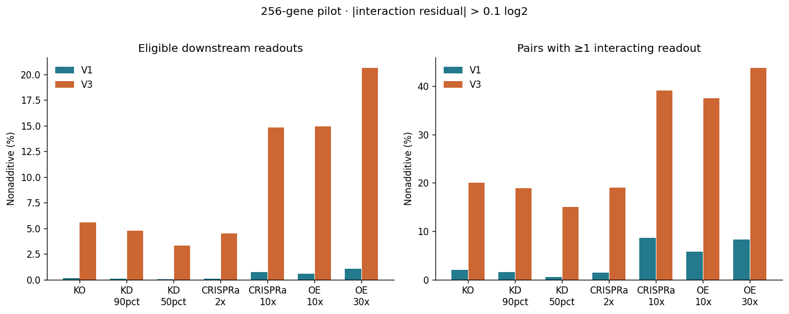

# Knockdown, CRISPRa and overexpression: 256-gene pilot

**Activation and overexpression are promising extensions for increasing nonadditive signal.**
Partial knockdown generally reduces it relative to KO in these simulations. In the sparse V1
network, strong activation/overexpression raises interaction prevalence several-fold, but most
downstream readouts remain close to log-additive. This supports further dose sweeps and targeted
analysis of shared responsive genes. It does not establish a universal difference between
experimental CRISPR modalities.

## What was run

The original V1 seed 42 and V3 seed 5 were regenerated from commit
`20af5d0ba0b7c287da90420aa0a42238406f1197`, retaining their 256-gene generator settings.
Each of 19 conditions has all 256 single perturbations and the same 4,096 uniformly sampled
unordered gene pairs (12.55% of the 32,640 possible pairs; sampling seed 20260928).
That is 155,648 double-condition simulations and 9,728 single-condition simulations in the
main pilot. Additional checks use V1 seeds 5/7 and stable-WT V3 seeds 3/7/9.

The new memory-bounded solver follows the original RNA ODE from WT with **s=0**, checking the
drift of every free gene. It uses explicit midpoint integration with local subdivision if a
step would make RNA negative. This estimates deterministic equilibria; it is not a bitwise
reproduction of the original stochastic/time-average experiment. Every failed run is retained
with its convergence flag. Neither a 2,000-gene experiment nor a new MLP training run was performed.

## Results

An interaction is `double_logFC - single_A_logFC - single_B_logFC`. The table uses an absolute
threshold of **0.1 log2**, corresponding to about 7.2% disagreement with the multiplicative
expression prediction. Both manipulated genes are excluded. WT, both singles and the double
must be at least `1e-4` in model expression units. Both singles and the double must converge.
These are descriptive effect-size thresholds, not p-values.

| Nominal intervention | V1 nonadditive readouts | V1 pairs with any interaction | V3 nonadditive readouts | V3 pairs with any interaction | V3 valid pairs / 4,096 |
|---|---:|---:|---:|---:|---:|
| KO | 0.141% | 2.00% | 5.577% | 20.06% | 2,786 |
| KD, 90% reduction | 0.109% | 1.54% | 4.739% | 18.88% | 2,733 |
| KD, 50% reduction | 0.018% | 0.46% | 3.334% | 15.07% | 3,052 |
| CRISPRa, 2× capacity | 0.070% | 1.42% | 4.512% | 19.03% | 2,785 |
| CRISPRa, 10× capacity | 0.727% | 8.62% | 14.842% | 39.17% | 2,515 |
| Overexpression, 10× nominal | 0.591% | 5.74% | 14.921% | 37.56% | 2,955 |
| Overexpression, 30× nominal | 1.077% | 8.33% | 20.661% | 43.83% | 2,902 |

All 4,096 V1 pairs are valid in these conditions. **V3 percentages are conditional on
convergence and expression eligibility**, and each row initially has a different denominator.

Matching the exact pairs AND readouts across all seven rows preserves the direction:

| Matched analysis | KO | KD90 | CRISPRa10 | OE30 |
|---|---:|---:|---:|---:|
| V1 nonadditive readouts, 4,096 pairs | 0.115% | 0.087% | 0.688% | 1.076% |
| V3 nonadditive readouts, 1,038 pairs | 0.446% | 0.392% | 2.433% | 3.513% |

This large V3 denominator effect matters: the intersection is a much more stable subset of
the network's responses. Its absolute rates should not be generalized to unresolved pairs,
and neither set of percentages describes all possible V3 outcomes unconditionally.

## What this says about buffering and shared downstream genes

Only 120 of V1's 256 genes have a functional outgoing edge; V3 has 251. The networks have
820 and 10,436 functional edges, respectively. Many pooled pair/readout entries therefore
cannot carry an interaction. The topology comparison changes density and out-degree structure
together, so it does not isolate a single causal buffering parameter.

For V1 KO, 1.56% of eligible readouts reachable from **both** targets exceed the threshold.
Among readouts where **both single perturbations already produce >0.1-log2 effects**, the
rate is 58.34%. The latter is a selected, responsive subset, not a population rate. Under
CRISPRa10 and OE30, its rates are 62.83% and 67.51%. Thus substantial interactions exist even
when the global histogram is dominated by zeros or tiny values.

A shared downstream path alone does not guarantee a large interaction. For a simple
feed-forward sigmoid target, set `h(z)=log2(sigmoid(z))`. Two input changes `u,v` produce
`h(z+u+v)-h(z+u)-h(z+v)+h(z)`, approximately
`-sigmoid(z)*(1-sigmoid(z))*u*v/log(2)` for small changes. The result can be very small in
saturated regimes or at weak doses. Cancellation and weak propagation can reduce it further.
The notebook includes this exact motif calculation.

## Dose and mechanism assumptions

The doses are a literature-informed **sensitivity grid**, not an estimated population
distribution of guide efficiencies. Gilbert et al. reported 90–99% knockdown with optimized
CRISPRi. Konermann et al. reported substantial gene-to-gene variability in SAM activation,
including >15× activation for eight genes in a selected twelve-gene panel and dependence on
basal expression. These observations do not justify a universal 2× CRISPRa or 30× ORF setting.
The 30× OE condition is an exploratory high-dose scenario.

Three mechanistic abstractions and a dose control are available:

- **KD / default CRISPRa:** multiply endogenous synthesis capacity by the requested factor.
  Feedback remains active. CRISPRa therefore raises the production ceiling in this abstraction.
- **Transgene overexpression:** add `(fold-1)*decay*WT_expression` to production, outside the
  sigmoid. This is a nominal total fold calibrated at the WT regulatory background.
- **Promoter CRISPRa alternative:** shift `alpha`, calibrated to the requested synthesis fold
  at WT, while retaining the old sigmoid ceiling. Unattainable doses raise an error by default;
  the sensitivity experiment explicitly opts into capping and records it.
- **Clamp control:** hold target RNA at exactly `fold*WT_expression`. At equal clamp doses,
  different technique labels have identical effects in this model.

Actuator assumptions materially affect the answer. With a nominal 10× promoter shift, 62.5%
of V1 targets and 53.1% of V3 targets hit the calibration ceiling. Corresponding primary
readout interaction rates are 0.272% and 2.064%, lower than the capacity model. This is a
model sensitivity, not evidence that real CRISPRa necessarily has either ceiling behavior.
The output tables include achieved target-fold percentiles; for capacity CRISPRa10 in V3,
the converged-single 10th–90th percentile range is about 7.22–11.54×.

## Robustness and validation

- Nine automated tests pass, including analytical independent-gene solutions, zero-dose
  and no-op limits, nonmutation, KO equivalence away from targets, target masking, convergence
  failure, promoter saturation, positivity under steep feedback, and independent ODE agreement.
- On selected actual-network singles/doubles across KO, KD90, CRISPRa10 and OE30, halving the
  time step, doubling the horizon and tightening tolerances gave maximum observed log2
  expression differences below `1e-6` for mutually converged cases above the expression floor.
  One slow V3 KD single became converged with the longer run; failures are therefore horizon-dependent.
- Sixteen independent adaptive DOP853 checks of high-residual doubles agreed to about
  `1.1e-6` log2 or better. These checks are representative, not exhaustive numerical certification.
- Three groups of four unperturbed stochastic trajectories per network, using the original
  `s=1e-4`, produced a maximum null interaction residual of 0.00716 log2; none crossed 0.1.
  This small null calibration does not test perturbation-specific stochastic basin switching.
- V1 seeds 5/7 reproduce stronger interaction prevalence under activation/OE than KO.
  V3 seeds 3/7/9 show the same broad activation/OE pattern. KD90 is not universally lower than
  KO: seed 3 is a counterexample. These V3 seeds were included because they reached a stable
  WT in the predefined seed-0–9 scan; six other seeds did not converge within the chosen horizon.
- The second notebook reports multiple residual cutoffs, alternative expression floors,
  inclusion/exclusion of targets, raw-expression additivity, and matched denominators. For example,
  removing the expression floor changes V3 KO/OE30 rates from 5.58%/20.66% to 7.28%/27.04%.

Two existing-analysis issues were identified. `ko_nodes` returned the saved WT convergence
flag even when a perturbation failed; this is fixed without changing the old KO intervention.
The original V3 notebook also broadcasts `alpha` against a column-vector regulatory input
in its Jacobian calculation. The new stability diagnostic uses the correct vector shapes.

## Suggested continuation

Keep a moderate activation condition and a stronger OE condition alongside KO and KD90.
Evaluate all readouts and a prespecified shared-responsive subset, with both manipulated genes
excluded. Record achieved target dose, convergence coverage and the chosen null scale. Repeat
over network seeds before drawing conclusions about a topology regime.

For MLP work, the larger tails provide more signal beyond an additive oracle, but that does
not guarantee predictive gains. Use matched pair splits across modalities and report the
expression-additive and log-additive baselines separately. The two notions are different:
`single_A + single_B - WT` is not the same as adding single log fold changes.

The 2,000-gene extension can use the same APIs and a sampled pair set. A full 2,000-gene
double-expression matrix contains 3.998 billion numbers (~32 GB at float64), so exhaustive
work should shard pairs and checkpoint each shard. This is why the pilot stops at 256 genes.

## Files and sources

Start with `small_GRN-modalities.ipynb`, then `small_GRN-modalities-robustness.ipynb`.
`results/modalities_256/summary.csv` contains all nineteen conditions per network.
`matched_denominators.csv`, `mask_sensitivity.csv`, numerical validation tables and the seed
summaries make the main qualifications inspectable. The companion `grn-modalities-data.zip`
contains every raw NPZ and numerical network snapshot; extract it at the repository root.

1. Aguirre et al. (2025), *Gene regulatory network structure informs the distribution of
   perturbation effects*, PLOS Computational Biology. https://doi.org/10.1371/journal.pcbi.1013387
2. Gilbert et al. (2014), *Genome-Scale CRISPR-Mediated Control of Gene Repression and Activation*,
   Cell. https://doi.org/10.1016/j.cell.2014.09.029
3. Konermann et al. (2015), *Genome-scale transcriptional activation by an engineered
   CRISPR-Cas9 complex*, Nature. https://doi.org/10.1038/nature14136
